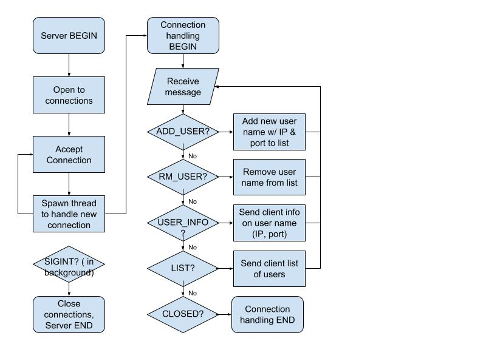
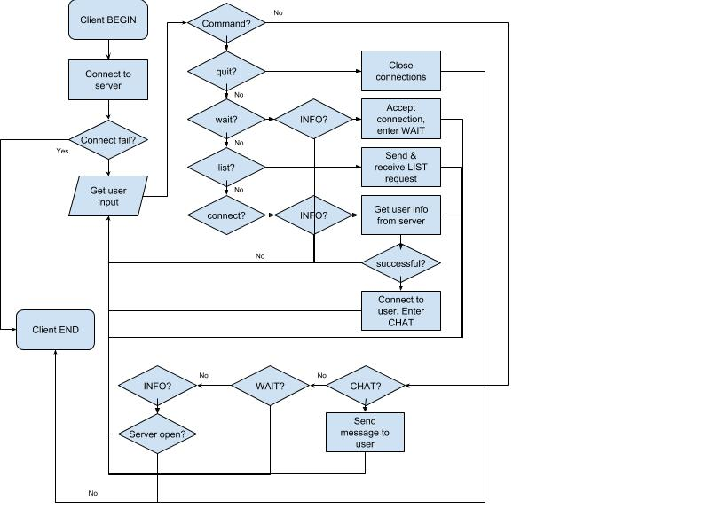

Philip Salire

psalire@ucsc.edu

CMPE 156/L Winter 2019

# Final Assignment: Chat

## Files

See README

## Overview

### How to use:

1. Run ```make``` to compile program.
2. Run ```server [port number] [-v (optional verbose)]``` to run server.
3. Run ```client [IP address] [port number] [username] [-v (optional verbose)]``` to run client.
4. In ```client```:
    * ```/list``` to get list of waiting users.
    * ```/connect [username]``` to connect to a waiting user.
    * ```/wait``` to wait for a user to connect.
    * ```Ctrl+C``` to end waiting or to end a chat with a user.
    * ```/quit``` to quit the client program.

### How it works:

Messages are passed in the form of a ```struct``` called ```Message```:

```
/* Chat message structure */
typedef struct message {
    char content[4096], /* Message content */
         username[128]; /* Who the message is from */
    uint8_t type; /* Uses MessageType */
    uint16_t seq; /* Used for MSG_MULTIPLE */
} Message;
```

Variable ```uint8_t type``` defines what the message is for, using the following:
```
enum MessageType {
    CLOSED = 0, /* Server closed connection */
    MSG, /* MSG for CHAT */
    MSG_MULTIPLE, /* MSGs length >4096 will be chunked (TODO) */
    ADD_USER, /* Request to add user to server list */
    RM_USER, /* Request to remove user from server list */
    USER_INFO, /* Request for connection info on a user */
    LIST, /* Request for list of waiting users */
    SUCCESS,
    FAIL
};
```
    
#### Program Flow:

##### Server:



##### Client:



## Limitations

* CHAT messages with length >4096 are cut.
* User names with length >4096 are cut.
